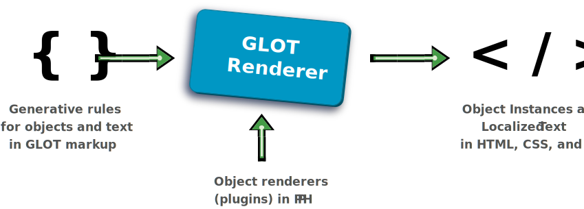

<p align="center">
  
</p>

[Framework](framework.md) / Components

# Component packages

The compositional architecture of GLOT framework is based on the abstract concept of **component** whose source code and assets are defined by a **package package**.

For example. each **widget** in the markup triggers the loading of a **component package**, which is a type of set source code and asset files needed to _render_ the HTML, JS, and CSS of a webpage.

<p align="center">
  
</p>

Assets referenced by the input code, such as graphics and fonts, are considered to be both input and output of the generative process.

### Component types

There are different types of component, each used by a module of the framework. In fact, the modules themselves are their own type of component.

| Component type                          | Used by   |
| --------------------------------------- | --------- |
| [builder](#builder-packages)            | Publisher |
| [collection](#collection-packages)      | Renderer  |
| [plugin](#plugin-packages)              | Renderer  |
| [provider](#provider-packages)          | Publisher |
| [publisher](#publisher-packages)        |           |
| [renderer](#renderer-packages)          | Builder   |
| [uploader](#uploader-packages)          | Publisher |
| [widget](components/widget-packages.md) | Renderer  |

A **component package** is a folder with at least one PHP file defining the main component class. The main class in the package can extend the main class of another package of the same type.

The framework registers [autoload functions](https://www.php.net/manual/en/language.oop5.autoload.php) for all types of components, which means that there is no need to declare them explicitly. For example, a **widget** is a JSON object with a widget property set to the **class name** of a component, such as `MyNamespace\MyWidget`. When rendering a widget, an autoloader function is automatically invoked to load the given component class.

The **autoload functions** look for the components under default locations within a project, which can also be customized via setting files and construction options.

## Naming conventions

1. Namespace
1. Component name
1. Type
1. Primary collection [**optional**]

**Project name**
If the component belongs to a primary collection, the component name can be prefixed with the collection name to highlight the relationship. For example, `bs4-navbar` suggest that the component belongs to a collection named bs4.

If the component is not primarily associated with a collection, then the project name is simply the component name.

In `component.json`, values are in **lowercase** and the type must be prefixed by "glot-".

-   **name:** {namespace}/{project name}
-   **type:** glot-{type}

**Example**
A widget named Navbar under the namespace Sagittarius and primarily associated with a collection named BS4, would have the property values:

-   **name:** sagittarius/bs4-navbar
-   **type:** glot-widget

## Package managers

The glot app, Composer, manually.

### Using composer

The use of [Composer](https://getcomposer.org/) for registering the location and dependencies of **component packages** is optional.

<!-- The [Composer autoloading](https://getcomposer.org/doc/01-basic-usage.md#autoloading) mechanism is treated as a fallback option for the cases when a component was not found via the standard autoload functions registered by the framework. -->

Regardless of whether one chooses to integrate Composer into a package or not, it is still recommended to place a `composer.json` file at the root level of the component package. This is because by design, the GLOT framework avoids defining setting files that capture information that is normally collected in a `composer.json` file.

The [file schema](https://getcomposer.org/doc/04-schema.md#properties) of `composer.json` is a standard way of capturing generic package-level information such as type, author, description, and so on.

If a `composer.json` is present in a package, its **type** property must be set to match the component type with a "glot-" prefix. For example, a **widget** component must be a **type** set to **glot-widget**. The prefixed value is considered a [custom type](https://getcomposer.org/doc/04-schema.md#type) by Composer.

For example, a typical a `composer.json` file

```json
{
    "type": "glot-widget",
    "name": "X/MyWidget",
    "description": "Example widget component",
    "autoload": {
        "psr-4": {
            "X\\Y\\": "src/"
        }
    }
}
```

provides a type, other basic information, and declares the location of the root folder to be used by the PSR-4 autoload mechanism.

### File Structure

A **component package** can be as simple as a folder with one PHP file named as the folder. The name of the folder is the name of the package. The PHP file that is named as the package is its **entry point**, and must define a single class, which must also be named as the package.

Basic package structure

```text
MyWidget
└── MyWidget.php
```

where the contents of `MyWidget.php` is

```php
namespace X\Y;

/**
 * Example entry-point class for the component.
 */
class MyWidget extends Widget
{
    // ...
}
```

The **entry point** file can also be place under a `src` folder at the root of the package, which is the preferred location for packages that have several files in them.

All component-specific setting files should be placed under a root-level `settings` folder. The main settings file should be a JSON file named **component.json**. For different type of components contain different basic settings, and there are some mandatory properties, like `name`, `version` and so on. Please check the detail from the documentation of each component.

For example, a common **widget package** structure is

```text
MyWidget
├── settings
│   └── component.json
├── src
│   └── MyWidget.php
└── composer.json
```

All source code files should be located under the root-level `src` folder. The path to PHP files should mimic their namespace declaration. For example, a class with namespace `Vendor\MyWidget\x\y` should placed under the folder `src/x/y`, since `src` is considered to be the root for the `Vendor\MyWidget` namespace.

Non PHP source code should be placed under sub-folders of `src` named by their common acronym in lowercase. For example, **NodeJS**, **JavaScript**, and **CSS**, should be placed under `nodejs`, `js`, and `css` sub-folders.

Generic assets needed by the component itself (i.e. not by its public profile) should be placed under a root-level `assets` folder.

#### The Glot Bazaar

Packages submitted to the [Glot Bazaar](http://glotbazaar.com) should include all assets used for their public profiles under a `store/assets` folder. They should also offer a way to install the component without including the store folder.

Having a `LICENSE` file and a `README.md` file is also recommended for public projects.

The typical file structure of a widget package in the [Glot Bazaar](http://glotbazaar.com) is:

```
MyWidget
├── assets
│   ├── images
│   │   └── example.svg
│   └── fonts
├── css
│   └── MyWidget.css
├── js
│   └── MyWidget.js
├── settings
│   └── widget.json
├── src
│   └── MyWidget.php
├── store
│   ├── assets
│   │   └── widget_icon.svg
│   └── profile.md
├── LICENSE
├── README.md
└── composer.json
```
