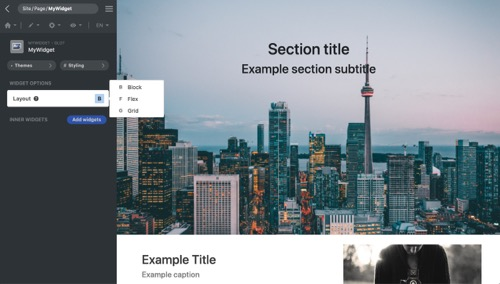

<p align="center">
  
</p>

[Framework](../framework.md) / [Components](../components.md) / [Widget package](widget-packages.md) / [Widget parameters](widget-parameters.md) / Dropdown

# Dropdown parameter

| Value type | Explanation                                                                                                               | Multilingual |
| ---------- | ------------------------------------------------------------------------------------------------------------------------- | ------------ |
| String     | The **render()** method receives the parameter value as it is. In GUI, users can choose the value from the dropdown menu. | No           |

## Properties

All properties are used for GUI only.

-   `options` **Array** - Dropdown options, each option is an **Object** with label and value.
-   `multiSelect` **Bool** - Enable multi-select.
-   `extendableOptions` **Bool** - Flag whether let website users add custom options in GUI.
-   `privilege` **String** - Enum of **administrator**, **editor** and **user**. Set permission requirement for changing custom options.

## Editor example in GUI

<p align="center">
  
<span style="display:block;">Dropdown parameter</span>
</p>

GUI offers a dropdown editor. Users can select the value from the dropdown menu. The dropdown menu is defined from the `option` property.

## Example and explanation

`params.json`

```json
[
    {
        "name": "layout",
        "type": "dropdown",
        "label": "Layout",
        "description": "Container layout",
        "options": [
            {
                "label": "Block",
                "value": "block"
            },
            {
                "label": "Flex",
                "value": "flex"
            },
            {
                "label": "Grid",
                "value": "grid"
            }
        ],
        "multiSelect": false,
        "extendableOptions": false
    }
]
```

`Widget data` Head over to [JSON schema](#json-schema) to check how the widget data is validated.

```json
{
    "widget": "MyWidget",
    "id": "MyWidget1",
    "params": {
        "layout": "grid"
    }
}
```

Example of the usage of the parameter in PHP class:

```php
namespace X\Y;

/**
 * Example entry-point class for the component.
 */
class MyWidget extends Widget
{
    public function render($data, $params)
    {
        // Add a call to the JS 'render' method into the "document ready"
        // event of the webpage. It does nothing if there is no JS code.
        $this->initJavaScriptWidget($params, 'render');

        $layout = $params['layout'];

        return [
            'style'=>"display:$layout;",
            'data'=>[
                'tag'=>'span',
                'data'=>'Sample widget'
            ]
        ];
    }
}

```

## JSON schema

```json
{
    "anyOf": [
        {
            "type": "string",
            "description": "Dropdown parameter with multi-select disabled"
        },
        {
            "type": "array",
            "description": "Dropdown parameter with multi-select enabled",
            "items": {
                "type": "string"
            }
        }
    ]
}
```
