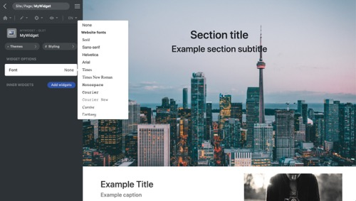

<p align="center">
  
</p>

[Framework](../framework.md) / [Components](../components.md) / [Widget package](widget-packages.md) / [Widget parameters](widget-parameters.md) / Font

# Font parameter

NOTE: GUI offers a dropdown menu and the options are coming from the website fonts.

| Value type | Explanation                                                                                                              | Multilingual |
| ---------- | ------------------------------------------------------------------------------------------------------------------------ | ------------ |
| String     | The **render()** method receives the parameter value as it is. Users can select the value from the dropdown menu in GUI. | No           |

## Editor example in GUI

<p align="center">
  
<span style="display:block;">Font parameter</span>
</p>

GUI offers a dropdown menu and the options are coming from the website fonts.

## Example and explanation

`params.json`

```json
[
    {
        "name": "font",
        "type": "font",
        "label": "Font"
    }
]
```

`Widget data` Head over to [JSON schema](#json-schema) to check how the widget data is validated.

```json
{
    "widget": "MyWidget",
    "id": "MyWidget1",
    "params": {
        "font": "Serif"
    }
}
```

Example of the usage of the parameter in PHP class:

```php
namespace X\Y;

/**
 * Example entry-point class for the component.
 */
class MyWidget extends Widget
{
    public function render($data, $params)
    {
        // Add a call to the JS 'render' method into the "document ready"
        // event of the webpage. It does nothing if there is no JS code.
        $this->initJavaScriptWidget($params, 'render');

        $font = $params['font'];

        return [
            'tag' => 'h2',
            'data' =>'Sample header.',
            'style'=>"font-family:$font;"
        ];
    }
}

```

## JSON schema

```json
{
    "type": "string"
}
```
