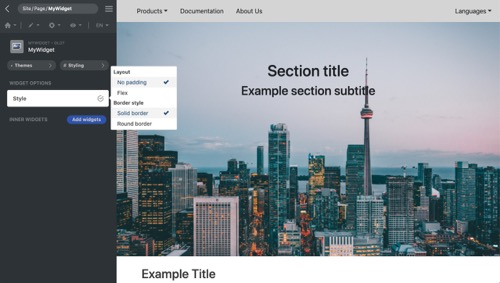

<p align="center">
  
</p>

[Framework](../framework.md) / [Components](../components.md) / [Widget package](widget-packages.md) / [Widget parameters](widget-parameters.md) / Group dropdown

# Group dropdown parameter

| Value type | Explanation                                                                                                                                  | Multilingual |
| ---------- | -------------------------------------------------------------------------------------------------------------------------------------------- | ------------ |
| Array      | The dropdown menus are grouped by different categories and the menu is multi-selectable. The parameter value is an array of selected option. | No           |

## Properties

All properties are used for GUI only.

-   `options` **Object** - Dropdown options. Compared with normal dropdown parameter, this type of parameter has another layer for gropus.
-   `extendableOptions` **Bool** - Flag whether let website users add custom options in GUI.
-   `privilege` **String** - Enum of **administrator**, **editor** and **user**. Set permission requirement for changing custom options.

## Editor example in GUI

<p align="center">
  
<span style="display:block;">Group dropdown parameter</span>
</p>

GUI offers a advanced dropdown editor. Options are grouped by different categories and multi-selectable.

## Example and explanation

`params.json`

```json
[
    {
        "name": "style",
        "type": "dropdown",
        "label": "Style",
        "description": "Container style",
        "options": {
            "layout": {
                "label": "Layout",
                "options": [
                    {
                        "value": "no-padding",
                        "label": "No padding"
                    },
                    {
                        "value": "flex",
                        "label": "Flex"
                    }
                ]
            },
            "borderStyle": {
                "label": "Border style",
                "options": [
                    {
                        "value": "solid-border",
                        "label": "Solid border"
                    },
                    {
                        "value": "round-border",
                        "label": "Round border"
                    }
                ]
            }
        },
        "extendableOptions": false
    }
]
```

`Widget data` Head over to [JSON schema](#json-schema) to check how the widget data is validated.

```json
{
    "widget": "MyWidget",
    "id": "MyWidget1",
    "params": {
        "style": {
            "layout": ["no-padding", "flex"],
            "borderStyle": ["solid-border"]
        }
    }
}
```

Example of the usage of the parameter in PHP class:

```php
namespace X\Y;

/**
 * Example entry-point class for the component.
 */
class MyWidget extends Widget
{
    public function render($data, $params)
    {
        // Add a call to the JS 'render' method into the "document ready"
        // event of the webpage. It does nothing if there is no JS code.
        $this->initJavaScriptWidget($params, 'render');

        $style = $params['style'];

        $className = '';

        foreach($style as $value) {
            foreach($value as $item) {
                $className = $className ? $className . " $item" : $item;
            }
        }

        return [
            'class'=>$className
            'data'=>[
                'tag'=>'span',
                'data'=>'Sample widget'
            ]
        ];
    }
}

```

## JSON schema

```json
{
    "type": "object"
}
```
