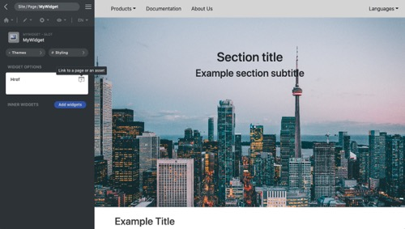

<p align="center">
  
</p>

[Framework](../framework.md) / [Components](../components.md) / [Widget package](widget-packages.md) / [Widget parameters](widget-parameters.md) / Href

# Href parameter

| Value type | Explanation                                                                                                                                                                                                                                                        | Multilingual |
| ---------- | ------------------------------------------------------------------------------------------------------------------------------------------------------------------------------------------------------------------------------------------------------------------ | ------------ |
| String     | When rendering the markup, the **render()** method receives the localized value of this type of parameter. If the value start with the https or http protocol, the value is regarded as the external link and the **render()** method receives the value as it is. | Yes          |

## Properties

-   `linkOption` **Bool** - Add a button into the parameter item of the GUI. The button opens the modal with all pages and assets in the website. Developers can select the page or the asset from the panel.

## Editor example in GUI

<p align="center">
  
<span style="display:block;">Href parameter with <b>linkOption</b> property enabled</span>
</p>

GUI offers a text editor that users can input text as parameter value. The button that let users select page or asset can be added to the editor.

<p align="center">
  
</p>

After clicking the button, the panel is switched. Users can select an asset or a page to be the parameter value.

## Example

`params.json`

```json
[
    {
        "name": "href",
        "type": "href",
        "label": "Href",
        "linkOption": true
    }
]
```

`Widget data` Head over to [JSON schema](#json-schema) to check how the widget data is validated.

```json
{
    "widget": "MyWidget",
    "id": "MyWidget1",
    "params": {
        "href": {
            "en": "home",
            "zh": "asset.png",
            "$en": {
                "status": "pending",
                "isSource": true,
                "author": "Diego",
                "time": 1599675492
            },
            "$es-ar": {
                "status": "pending",
                "author": "Diego",
                "time": 1599675588,
                "value": "https://glot.ca"
            },
            "$zh": {
                "status": "inprogress",
                "author": ""
            }
        }
    }
}
```

Example of the usage of the parameter in PHP class:

```php
namespace X\Y;

/**
 * Example entry-point class for the component.
 */
class MyWidget extends Widget
{
    public function render($data, $params)
    {
        // Add a call to the JS 'render' method into the "document ready"
        // event of the webpage. It does nothing if there is no JS code.
        $this->initJavaScriptWidget($params, 'render');

        $href = $params['href'];

        return [
            'tag' => 'a',
            'data' => 'Read more >',
            'href'=> $href,
            'target'=> '_blank'
        ];
    }
}

```

## JSON schema

```json
{
    "type": "object",
    "description": "Href parameter",
    "properties": {
        "$": {
            "type": "object",
            "description": "Meta data of translation",
            "properties": {
                "state": {
                    "type": "object",
                    "description": "state. Pairs of language and state",
                    "patternProperties": {
                        "^[a-z]?$": {
                            "type": "object",
                            "properties": {
                                "master": {
                                    "type": "string",
                                    "enum": [
                                        "pending",
                                        "inprogress",
                                        "translated",
                                        "approved"
                                    ]
                                },
                                "secondary": {
                                    "type": "string",
                                    "enum": [
                                        "returned",
                                        "prepopulated",
                                        "awaiting",
                                        "machineTranslated"
                                    ]
                                },
                                "isSource": {
                                    "type": "boolean"
                                }
                            }
                        }
                    }
                },
                "lastAuthor": {
                    "type": "object",
                    "description": "Last edit user. Pairs of language and user id.",
                    "patternProperties": {
                        "^[a-z]?$": {
                            "type": "integer"
                        }
                    }
                },
                "time": {
                    "type": "object",
                    "description": "Last edit time. Pairs of language and value.",
                    "patternProperties": {
                        "^[a-z]?$": {
                            "type": ["integer", "string"]
                        }
                    }
                }
            },
            "additionalProperties": false
        }
    }
}
```
