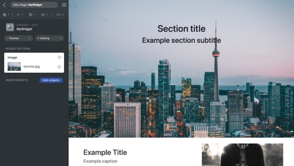
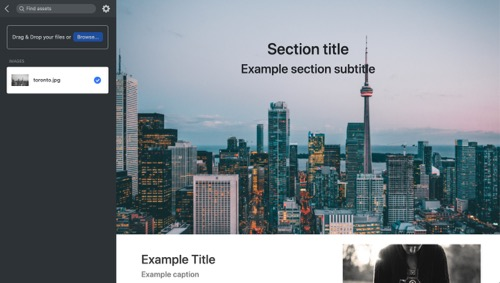

<p align="center">
  
</p>

[Framework](../framework.md) / [Components](../components.md) / [Widget package](widget-packages.md) / [Widget parameters](widget-parameters.md) / Media

# Media parameter

| Value type | Explanation                                                                                                                                                                                                                                                  | Multilingual |
| ---------- | ------------------------------------------------------------------------------------------------------------------------------------------------------------------------------------------------------------------------------------------------------------ | ------------ |
| String     | The value of the parameter is the relative path to the asset based on the **assets** folder. When rendering the markup, the **render()** method receives the parsed value, the url of the asset. In GUI, users can choose asset of the website as the value. | Yes          |

## Properties

-   `targetType` **String** - Enums of **img**, **video** and **doc**. This property is only used in GUI. It restricts the type of uploading files.

## Editor example in GUI

<p align="center">
  
<span style="display:block;">Media</span>
</p>

GUI offers a media editor. Users can select the asset from the asset panel.

<p align="center">
  
</p>

After clicking the button, the panel is switched. Users can select an asset to be the parameter value.

## Example and explanation

`params.json`

```json
[
    {
        "name": "img",
        "type": "media",
        "label": "Image",
        "description": "Choose a image",
        "targetType": "img"
    }
]
```

`Widget data` Head over to [JSON schema](#json-schema) to check how the widget data is validated.

```json
{
    "widget": "MyWidget",
    "id": "MyWidget1",
    "params": {
        "img": {
            "en": "sky.jpg",
            "zh": "sub-folder/star.png",
            "$en": {
                "status": "approved",
                "isSource": true,
                "author": "Diego",
                "time": 1599675492
            },
            "$zh": {
                "status": "approved"
            }
        }
    }
}
```

Example of the usage of the parameter in PHP class:

```php
namespace X\Y;

/**
 * Example entry-point class for the component.
 */
class MyWidget extends Widget
{
    public function render($data, $params)
    {
        // Add a call to the JS 'render' method into the "document ready"
        // event of the webpage. It does nothing if there is no JS code.
        $this->initJavaScriptWidget($params, 'render');

        $img = $params['img'];
        $alt = $params['alt'];

        return [
            'tag' => 'img',
            'src' => $img,
            'alt' => $alt
        ];
    }
}

```

## JSON schema

```json
{
    "type": "object",
    "description": "Media parameter",
    "properties": {
        "$": {
            "type": "object",
            "description": "Meta data of translation",
            "properties": {
                "state": {
                    "type": "object",
                    "description": "state. Pairs of language and state",
                    "patternProperties": {
                        "^[a-z]?$": {
                            "type": "object",
                            "properties": {
                                "master": {
                                    "type": "string",
                                    "enum": [
                                        "pending",
                                        "inprogress",
                                        "translated",
                                        "approved"
                                    ]
                                },
                                "secondary": {
                                    "type": "string",
                                    "enum": [
                                        "returned",
                                        "prepopulated",
                                        "awaiting",
                                        "machineTranslated"
                                    ]
                                },
                                "isSource": {
                                    "type": "boolean"
                                }
                            }
                        }
                    }
                },
                "lastAuthor": {
                    "type": "object",
                    "description": "Last edit user. Pairs of language and user id.",
                    "patternProperties": {
                        "^[a-z]?$": {
                            "type": "integer"
                        }
                    }
                },
                "time": {
                    "type": "object",
                    "description": "Last edit time. Pairs of language and value.",
                    "patternProperties": {
                        "^[a-z]?$": {
                            "type": ["integer", "string"]
                        }
                    }
                }
            },
            "additionalProperties": false
        }
    }
}
```
