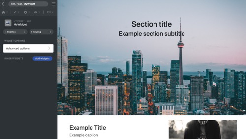
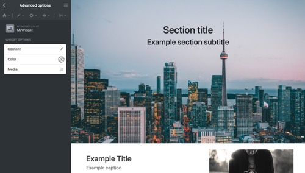
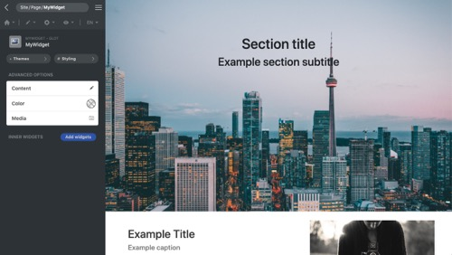

<p align="center">
  
</p>

[Framework](../framework.md) / [Components](../components.md) / [Widget package](widget-packages.md) / [Widget parameters](widget-parameters.md) / Submenu

# Submenu parameter

NOTE: The submenu parameter is only used for GUI. It groups several parameters in the panel.

## Properties

-   `inline` **Bool** - **true**: Group the parameters in the current panel. **false**: Group the parameters in another panel.
-   `collapse` **Bool** - Whether the group of parameters is collapsible.
-   `openByDefault` **Bool** - If the `collapse` is set to true, whether the group of parameters is opened by default.
-   `context` **Bool** - Whether the group of parameters is displayed as an independent module.

## Editor example in GUI

<p align="center">
  

<span style="display:block;">Sub-menu parameter with the <b>inline</b> property set to false</span>
</p>

<p align="center">
  
<span style="display:block;">Sub-menu parameter with the <b>inline</b> property set to true</span>
</p>

## Example and explanation

`params.json`

```json
[
    {
        "name": "advancedOptions",
        "type": "submenu",
        "label": "Advanced options",
        "data": [
            {
                "type": "text",
                "name": "text",
                "label": "Content"
            },
            {
                "type": "color",
                "name": "color",
                "label": "Color"
            },
            {
                "type": "media",
                "name": "media",
                "label": "Media"
            }
        ]
    }
]
```
