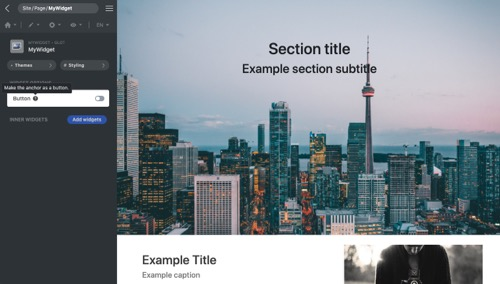

<p align="center">
  
</p>

[Framework](../framework.md) / [Components](../components.md) / [Widget package](widget-packages.md) / [Widget parameters](widget-parameters.md) / Switch

# Switch parameter

| Value type | Explanation                                                                        | Multilingual |
| ---------- | ---------------------------------------------------------------------------------- | ------------ |
| Bool       | When rendering the markup, the **render()** method receives **true** or **false**. | No           |

## Editor example in GUI

<p align="center">
  
<span style="display:block;">Switch parameter</span>
</p>

GUI offers a switch editor. The description is displayed as a tooltip.

## Example and explanation

`params.json`

```json
[
    {
        "name": "isButton",
        "type": "switch",
        "label": "Button",
        "description": "Make the anchor as a button"
    }
]
```

`Widget data` Head over to [JSON schema](#json-schema) to check how the widget data is validated.

```json
{
    "widget": "MyWidget",
    "id": "MyWidget1",
    "params": {
        "isButton": true
    }
}
```

Example of the usage of the parameter in PHP class:

```php
namespace X\Y;

/**
 * Example entry-point class for the component.
 */
class MyWidget extends Widget
{
    public function render($data, $params)
    {
        // Add a call to the JS 'render' method into the "document ready"
        // event of the webpage. It does nothing if there is no JS code.
        $this->initJavaScriptWidget($params, 'render');

        $href = $params['href'];

        $className = $params['isButton'] ? 'btn btn-primary' : '';

        return [
            'tag' => 'a',
            'class' => $className,
            'data' => 'Read more >',
            'href'=> $href,
            'target'=> '_blank'
        ];
    }
}

```

## JSON schema

```json
{
    "type": "boolean"
}
```
