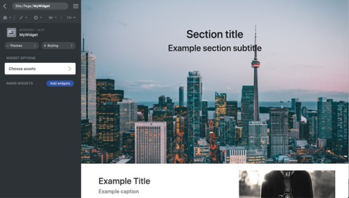

<p align="center">
  
</p>

[Framework](../framework.md) / [Components](../components.md) / [Widget package](widget-packages.md) / [Widget parameters](widget-parameters.md) / System

# System parameter

NOTE: System parameter is only used in GUI, it lets users to switch the current panel to another system panel.

## Properties

-   `systemPanel` **String** - Enum of [**assets** | **fonts** | **palettes**] Choose the panel to switch to.

## Editor example in GUI

<p align="center">
  
<span style="display:block;">System parameter</span>
</p>

## Example and explanation

`params.json`

```json
[
    {
        "name": "assets",
        "type": "system",
        "label": "Choose assets",
        "systemPanel": "assets"
    }
]
```
