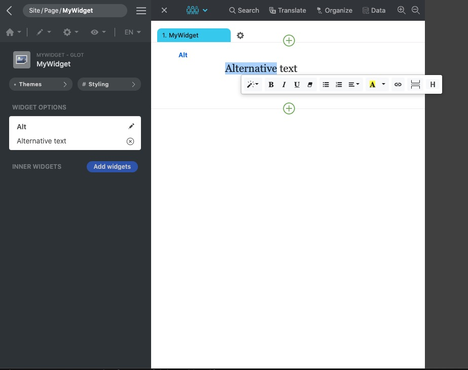

<p align="center">
  
</p>

[Framework](../framework.md) / [Components](../components.md) / [Widget package](widget-packages.md) / [Widget parameters](widget-parameters.md) / Text

# Text parameter

| Value type | Explanation                                                                                                | Multilingual |
| ---------- | ---------------------------------------------------------------------------------------------------------- | ------------ |
| String     | When rendering the markup, the **render()** method receives the localized value of this type of parameter. | Yes          |

## Properties

-   `editor` **Bool** - Enable the rich text editor in the GUI.
-   `live` **Bool** - Whether redraw the widget or refresh the website in the GUI while changing the parameter.
-   `notranslate` **Bool** - Whether auto translate the parameter value when adding new language to the website in the GUI. If the parameter is used for URL or similar purpose, this property should be set to **false**.
-   `headerLevel` **[1|2|3|4|5|6]** The highest header lever that the rich text editor can set.

## Editor example in GUI

<p align="center">
  
<span style="display:block;">Text parameter with <b>editor</b> property enabled</span>
</p>

GUI offers a text editor that can let users edit the parameter. The rich text editor can be enabled.

## Example and explanation

Example with notranslate set to false:

`params.json`

```json
[
    {
        "name": "alt",
        "type": "text",
        "label": "Alt",
        "editor": false,
        "live": true,
        "notranslate": false
    }
]
```

`Widget data` Head over to [JSON schema](#json-schema) to check how the widget data is validated.

```json
{
    "widget": "MyWidget",
    "id": "MyWidget1",
    "params": {
        "alt": {
            "$": 1
        }
    }
}
```

Example with notranslate set to true:

`params.json`

```json
[
    {
        "name": "url",
        "type": "text",
        "label": "Url",
        "editor": false,
        "live": false,
        "notranslate": true
    }
]
```

`Widget data`

```json
{
    "widget": "MyWidget",
    "id": "MyWidget1",
    "params": {
        "alt": {
            "en": "Hello World!",
            "$en": {
                "status": "pending",
                "isSource": true,
                "author": "Diego",
                "time": 1599675492
            },
            "$en-ar": {
                "status": "pending",
                "author": "Diego",
                "time": 1599675588,
                "value": "¡Hola Mundo!"
            },
            "$zh": {
                "status": "pending",
                "author": "",
                "time": 1599675588,
                "value": "你好 世界!"
            }
        }
    }
}
```

Example of the usage of the parameter in PHP class:

```php
namespace X\Y;

/**
 * Example entry-point class for the component.
 */
class MyWidget extends Widget
{
    public function render($data, $params)
    {
        // Add a call to the JS 'render' method into the "document ready"
        // event of the webpage. It does nothing if there is no JS code.
        $this->initJavaScriptWidget($params, 'render');

        $alt = $params['alt'];

        return ['tag' => 'h1', 'data' => $alt];
    }
}

```

## JSON schema

```json
{
    "anyOf": [
        {
            "type": "object",
            "description": "Text parameter with auto translation enabled",
            "properties": {
                "dictionary": {
                    "type": "string"
                },
                "index": {
                    "type": ["string", "integer"],
                    "pattern": "^[1-9]?$"
                }
            },
            "required": ["dictionary", "index"]
        },
        {
            "type": "object",
            "description": "Multilingual parameter with auto translation disabled",
            "properties": {
                "$": {
                    "type": "object",
                    "description": "Meta data of translation",
                    "properties": {
                        "state": {
                            "type": "object",
                            "description": "state. Pairs of language and state",
                            "patternProperties": {
                                "^[a-z]?$": {
                                    "type": "object",
                                    "properties": {
                                        "master": {
                                            "type": "string",
                                            "enum": [
                                                "pending",
                                                "inprogress",
                                                "translated",
                                                "approved"
                                            ]
                                        },
                                        "secondary": {
                                            "type": "string",
                                            "enum": [
                                                "returned",
                                                "prepopulated",
                                                "awaiting",
                                                "machineTranslated"
                                            ]
                                        },
                                        "isSource": {
                                            "type": "boolean"
                                        }
                                    }
                                }
                            }
                        },
                        "lastAuthor": {
                            "type": "object",
                            "description": "Last edit user. Pairs of language and user id.",
                            "patternProperties": {
                                "^[a-z]?$": {
                                    "type": "integer"
                                }
                            }
                        },
                        "time": {
                            "type": "object",
                            "description": "Last edit time. Pairs of language and value.",
                            "patternProperties": {
                                "^[a-z]?$": {
                                    "type": ["integer", "string"]
                                }
                            }
                        }
                    },
                    "additionalProperties": false
                }
            }
        }
    ]
}
```
