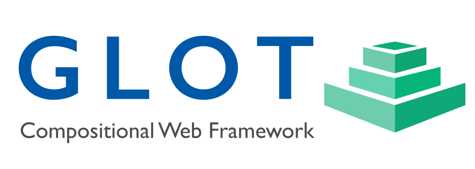

<!-- pandoc chapter1.md -s -o output.icml -->
<!-- see: https://shd101wyy.github.io/markdown-preview-enhanced/#/file-imports?id=configure-images -->

<p align="center">
  
</p>

# Web developing with GLOT

**GLOT** is both a language and a framework for building and publishing websites.

The [language](#language) offers **compositionality** and **multilingualism** at the markup level, addressing two architectural limitations of HTML. Compositionality is achieved by facilitating the coding of a webpage using components, while multilingualism is achieved by representing attribute and parameter values as localizable objects.

The **framework** is a set of [modules](Framework-Modules) to render, build and publish websites. All modules of the framework can be extended with cross-language components. Community-made components can be obtained from standard repositories as well as the [GLOT Bazaar](http://glotbazaar.com), which is a marketplace where developers can discover [widgets](#widgets), [collections](#collections), [templates](website-templates), [plugins](#plugins), [tutorials](#tutorials), and much more.

The syntax of the [GLOT language](#GLOT-language) is the well-known JavaScript Object Notation ([JSON](https://www.json.org/json-en.html)), making it east to get started without having to learn a new syntax. [Other syntaxes](#Optional_syntaxes) are available via plugins.

The GLOT markup of a webpage is often made entirely of nested JSON objects called [widgets](#widgets). The compositional nature of widgets enables the building of advanced webpages with little coding. For example, the GLOT page

```json
{
    "widget": "Page",
    "data": [
        { "widget": "Navbar", "params": ..., "data": ... },
        { "widget": "Section", "params": ..., "data": ... },
        { "widget": "Section", "params": ..., "data": ... },
        { "widget": "Footer", "params": ..., "data": ... }
    ]
}
```

uses the [Page](http://glotbazaar.com/widgets/page), [Navbar](http://glotbazaar.com/widgets/navbar), [Section](http://glotbazaar.com/widgets/section), and [Footer](http://glotbazaar.com/widgets/footer) widgets available from the [marketplace](http://glotbazaar.com) to build the page below (see [full code](#example)).

<p align="center">
  
</p>

<!-- box-shadow: rgba(0, 0, 0, 0.117647) 0px 0px 8px 0px, rgba(0, 0, 0, 0.239216) 0px 4px 8px 0px; -->

Developers can [create new widget packages](#new-widget-packages) to solve a wide range of layout and functionality challenges. At a minimum, **widget package** defines a class in **PHP or NodeJS** with a render method that returns GLOT or HTML code for the given parameters of a widget. The package can also define client-side JavaScript, CSS, and general assets such as fonts and images.

**Widget rendering** can happen on the server or the client, and at build time or request time. In addition, widget packages can depend on shared libraries, which allows them to render components based on other frameworks such as [React](#react-example), [Next.js](#nextjs-example), [Angular](#example), and more. New language syntaxes can be added via plugins for [integrated coding experiences](#other-syntaxes).

**Widget composition** also allows for widgets that are made out of other widgets. For example, a common building block of many advanced widgets is the [standard Image widget](#image), which includes lazy loading, automatic `srcset` attribute, and even priority loading for images whose location after pre-rendering is "above the fold".

The [GLOT philosophy](#glot-philosophy) is to avoid ad-hoc page markup and aim to build all pages using only widgets. A group of [design principles](#design-principles) are available to widget developers interested in striking a balance between easy of use and versatility.

## Origins

The GLOT project started with the objective of creating a markup language for generating webpages in multiple languages, or, in other words, a **polyglot HTML**. The project's objective soon expanded to include **coding modularity** in terms of full-stack components.

Eventually the project took a life of its own, and its scope began to expand in response to developers' needs with features such as [master pages](#master_pages), [pre-rendering](#pre-rendering), [website-level theming](#theming), [data sources](#data_sources), [dynamic folders](#dynamic-folders), and [git conflict resolution](#git_resolution). Today, GLOT is an end-to-end framework for [building](#builder) and [publishing](#publisher) dynamic and static websites.

The name **GLOT** is a backronym that stands for **Generative Language with Objects and Text**. The term expansion fits because the language is designed to express **generative rules** that control the rendering of HTML using **JSON objects** and **localizable text**. In the [GLOT language](#the-language), the _generative rules_ are the parametric logic defined by the methods and assets controlling the rendering of a webpage.

<!-- The preferred spelling is all uppercase (GLOT), but "GLOT" and "glot" can also be used when needed. -->

In its simplest form, the language is indeed a polyglot HTML with a JSON syntax. For example, the GLOT markup:

```json
{
    "tag": "body",
    "data": {
        "tag": "h1",
        "data": { "en": "Hello, World!", "es": "¡Hola, mundo!" }
    }
}
```

leads to the rendering of an HTML page for English

```html
<html lang="en">
    <body>
        <h1>Hello, World!</h1>
    </body>
</html>
```

and another HTML page for Spanish

```html
<html lang="es">
    <body>
        <h1>¡Hola, mundo!</h1>
    </body>
</html>
```

More [advanced options](#localization) for localization are also supported, such as code-based dictionary files, multi-language sources, and rendering logic for missing language-region tags.

**Coding modularity** is implemented by an abstract language construct ([widget](language.md#widgets)) and by a concrete framework implementation ([widget package](#widget-packages)). The term **widget** is often used in both cases and must be disambiguated by context. In the context of the language, a **widget** is the _parametric declaration_ of a [widget package](#widget-packages). In the context of the framework, a **widget** is a type of component package, which is the set of source and asset files needed to render the HTML, JS, and CSS code of [widget instances](#definitions).

## Framework Modules

The **GLOT framework** is composed of three core modules: [Renderer](renderer.md), [Builder](builder.md), and [Publisher](publisher.md).

The [Renderer](#renderer) is the main module and has no dependencies. It is a standalone project with all that is needed to render HTML webpages written in GLOT. That makes the Renderer the only essential dependency of dynamic GLOT websites. It can also be used from NodeJS or other languages to transform GLOT to HTML (e.g., see [rendering using gulp](ful_renderer.md))

The [Builder](#builder) is the development module responsible for optimizing a website for production environments. It also performs code transformations, such as converting SCSS to CSS, and enables common optional GLOT syntaxes, such as YAML and [GLAML](#glaml).

The [Publisher](#publisher) is the last module in the development pipeline, and is responsible for uploading websites to web hosting services.

The modules of the framework can be extended via components (see Fig. 1). [Widgets](#widgets) are abstract components of the language and concrete components of the **Renderer**. The **Renderer** can also be extended with [plugins](#Plugins). Similarly, the **Builder** and the **Publisher** can be can extended with [building tasks](#tasks) and [hosting providers](Hosting-Provider), respectively. Moreover, both modules and components can be extended via [class inheritance](extending_with_class_inheritance.md).

<p align="center">
  
<figure>
  
  <figcaption><strong>Fig.1 - Core modules and components of the GLOT Framework.</strong> <br> The input is GLOT code, <strong>{ }</strong>, and assets (JS and CSS libraries, images, fonts, etc). The output is a static or dynamic website. For static websites, the Builder sends the  Renderer-generated HTML code, <strong>< / ></strong>, to the Publisher, whereas for dynamic websites, it sends the given GLOT code so that a Renderer in the host can generate the HTML code when needed.</figcaption>
</figure>
</p>

---

## Getting started

This tutorial covers the creation of a website project, the testing of it within a development environment, and the publication of the website to a production server. The entire process only involves the execution of three command-line scripts.

The minimum requirement to render a GLOT website is to have [PHP 7.1+](https://www.php.net/) installed.

There are three main ways to work with the framework:

1. use the [Composer](https://getcomposer.org/) package manager;
1. use the [glot CLI](#glot-cli) app; or
1. download modules and components manually.

The following steps are for option 1, and assume that [composer](https://getcomposer.org/) is globally available from the command line.

An empty website project can be created by:

```zsh
$ mkdir {PROJECT-PATH}
$ cd {PROJECT-PATH}
$ composer require glot/glot
```

where `{PROJECT-PATH}` is the path to the new folder that is to be created and initialized. The pages and folders of the website should be added under a `pages` sub-folder.

Alternatively, it is often more convenient to start from a website template. In that case, a website project can be created with the following composer command:

```zsh
$ composer create-project glot/basic-site {PROJECT-PATH}
```

The argument `glot/basic-site` instructs Composer to initialize the folder with a [basic website](basic_site_template.md) template, which is made out of a small set of standard widgets, such as [Page](page_widget.md), [Navbar](navbar_widget.md), and [Footer](footer_widget.md).

Other standard templates to consider to get started:

-   `glot/blank-site`
    A [blank website template](blank_site_template.md) defining the standard folder structure, a single home page and no widgets.

-   `glot/blog-site`
    The simple [blogging websites](blog_site_template.md) with **static search functionality** that allows for efficient and inexpensive static website hosting.

Many more website templates are available at the [GLOT Bazaar](https://glotbazaar.com).

### Testing a website on localhost

The next step is to choose the **web server** that will answer HTTP requests generated from `localhost` in a development environment. Common options are [Apache](http://httpd.apache.org/docs/2.4/install.html), [NodeJS Express](https://expressjs.com/), and the [built-in PHP web server](https://www.php.net/manual/en/features.commandline.webserver.php). In this tutorial we will use the built-in web server offered by PHP because it requires no additional installations, is available in all PHP development environments, and runs with user writing permissions.

> \
> User writing permissions are needed by the Renderer only to write to the `www/public` sub-folder. If using a different web server, the `www/public` folder should simply be made writable by it.
> ` `

To launch the built-in web server, change directory to the `www` folder within the website project, and start the web server there.

```zsh
$ cd {PROJECT-PATH}/www
$ php -S localhost:8000
```

While the PHP web server is running, the URL `http://localhost:8000` should display the website.

<!-- The rendering of the [basic website](basic_site_template.md) template should look like

[screenshot] -->

### Publishing to a web hosting provider

The first step to publish a GLOT website with the Publisher is to create a `host.json` file. The file can be created manually according to the [host file schema](host_fie_schema.md). It can also be created with the following interactive script:

```zsh
$ composer create host {HOST-NAME}
```

The script will prompt for the information needed to upload the website to a hosting provider, such as the name of the provider, the credentials needed to connect to it, the name of the website to publish, the domain name for the website, and an optional the security certificate. When finished, the script will create the sub-folder `hosts/{HOST-NAME}` with the requested `host.json` file in it.

Please note that the interactive script simplifies the process of collecting the parameters of a host but it does not cover advanced cases such as [compilation options](compilation_options.md) or the use of extended classes for the Renderer and/or Builder. For advanced cases, the script can still be used to create the initial `host.json` file, which can then be edited manually according to the [host file schema](host_fie_schema.md).

The `{HOST-NAME}` is the only argument that one needs to publish and re-publish a website since everything else, including the target website, is included in the generated `host.json` file.

To publish a website based on the `{HOST-NAME}` parameters, execute the following script.

```zsh
$ composer publish {HOST-NAME}
```

The website should now be live on the web at the selected domain!

To re-publish a website, simply run the same command again. The [Publisher](publisher.md) will compare the local files against the remote files and only transfer and delete what is needed to synchronize the remote files with the local ones. If the host defines a **Content Delivery Network (CDN)**, the Publisher will also invalidate the CDN contents as needed.

### Installing additional web hosting providers

By default, the **Publisher** offers only a short list of providers, such as AWS, Azure, GoogleCloud, GitHub and Self hosting. More providers can be found at the [GLOT Bazaar](http://glotbazaar.com) and installed with Composer.

```zsh
$ composer add provider {PROVIDER-NAME}
```

Once installed, the host creation script should start offering the newly added provider among the options.

<!-- ## Working with multiple websites

What do to with having many websites.

Use a router???? or different port numbers. Or a sites folder??? -->

---

# Understanding the framework

## What is it for?

The framework is ideal for building websites focused on content. While appropriate for both static and dynamic websites, it is not meant for building app-like websites. Some usage scenarios are:

-   **Website developing** for static and dynamic websites built around content that is multilingual and based on reusable parametric components;
-   **Templating systems** that want to go beyond the functionality of handlebars and add reusable HTML patterns;
-   **Exporting functionality** that needs a standard language for exporting/importing website projects based on components.

**Web developers** can start by creating unilingual websites and then add more languages as needed. GLOT is always multilingual, even if one starts with a single language.

**Templating engines**, such as [Mustache](http://github.com/janl/mustache.js) and [HandlebarsJS](HandlebarsJS), can be implemented in GLOT, or be integrated with it via [syntax plugins](#other-syntaxes).

**Web design/building apps** can use GLOT as a **standard file format** for exporting and importing component-based website projects. GLOT is a JSON-based language that represents a website project in terms of parametric components that can be consumed by different design and development tools.

### Integrations

<!-- The modern web draws much of its power from an amazing community of developers who create tools, libraries and frameworks that can be assembled together to solve novel challenges.  -->

The GLOT framework can be integrated with other tools across different languages, including PHP, NodeJS, and Python. For example, it is possible to use glot as a [NodeJS package](), or manage users using the PHP [Symphony plugin](). It is also natural to create [React components in glot]() using a plugin to process [JSX code](jsx_plugin.md).

<!-- See pandoc: https://pandoc.org/MANUAL.html#pandocs-markdown -->

GLOT projects integrate naturally with other web libraries and platforms because the language is simply a different way of defining web content (i.e. HTML, JS, and CSS). Some advanced integrations might require the development of **Renderer plugins** in order to bridge the different technologies.

### Widget modularity and collections

Widgets are a special component type in the framework due to several reasons. They are components of the GLOT language itself, whereas other component types extend modules of the framework. Moreover, they are instantiated in a webpage alongside other widgets with different origins and objectives. Since the rendering of a widget leads to the addition of HTML, JS, CSS, and other assets into a common webpage, the potential for code conflicts is significant, and it falls on the framework to provide orchestration.

There are five mechanisms in charge of facilitating the harmonious co-existence of widget instances within a webpage.

1. [Namespace encapsulation](#Namespace-encapsulation) in JS and CSS
1. [Dependency graph analysis](#dependency-graph-analysis)
1. Declaration of [compositional constraints](#compositional-constraints)
1. [Shared CSS variables](Shared-CSS-variables) for [theming](#theming) and [media selectors](#media-selectors)
1. [Collections](#collections)

While all these mechanisms are mostly relevant to widget developers, the idea of **collections** is relevant to everyone. A **collection** is a grouping of widgets that are meant to be used together. Since it's a general concept, they can be used to address the following consistency types:

-   **compositional:** to ensure that widgets "snap" well with one another;
-   **graphic:** to enforce common design principles;
-   **coding:** to guaranty the inclusion of coherent dependencies on JS and CSS libraries.

The [GLOT Bazaar](http://glotbazaar.com) makes it easy to [discover collections](http://glotbazaar.com/collections) and install them with a single command.

---

## Next steps

1. Learn more about [the GLOT language](#the-GLOT-language)

1. Follow a visual tutorial on [website building with GLOT](#web-building-tutorial)

1. Learn how to [create widget packages](#create-widget-packages)

1. Search the [GLOT Bazaar](http://glotbazaar.com) for solutions to your website needs

## Changelog

-   1.0.1: ...
-   1.0.0: Initial public release.

## Roadmap

-   Better examples on how to ...
-   Making it possible to ...

## Contributing

This project welcomes contributions and suggestions. Most contributions require you to agree to a Contributor License Agreement (CLA) declaring that you have the right to and actually do, grant us the rights to use your contribution. For details, visit our Contributor License Agreement (CLA).

When you submit a pull request, a CLA-bot will automatically determine whether you need to provide a CLA and decorate the PR appropriately (e.g., label, comment). Simply follow the instructions provided by the bot. You will only need to do this once across all repos using our CLA.

This project has adopted the [Proximify Open Source Code of Conduct](code_of_conduct.md). For more information see the Code of Conduct FAQ or contact support@proximify.com with any additional questions or comments.

## License

Copyright (c) Proximify Inc. All rights reserved.

Licensed under [GPLv2](https://www.gnu.org/licenses/old-licenses/gpl-2.0.en.html) (or later) from the [Free Software Foundation](https://www.fsf.org/).

GLOT is made by Proximify. We invite the community to participate.
