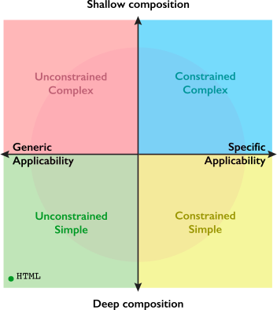

  

[Framework](#framwork) / Philosophy

# GLOT Philosophy

The framework is not opinionated regarding what is the best way to mange a project or what the building blocks of a webpage should be. The **GLOT philosophy** fills that gap by providing a set of strong opinions regarding the best way to go in order to maximize efficiently and satisfaction with the results.

There are five main **roles** for individuals participating as a team in a GLOT project.

1. Widget Developer
1. Graphic Designer
1. Page Builder
1. Copy Editor (Content Creator)
1. Language Translator

**Page builders** must execute the design created by the **graphic designers** using the building blocks created by **widget developers**. In turn, **Ccopy editors** must work with the pages built by the **page builders** and coordinate their work with the **language translators**.

The **GLOT philosophy** provides

- a set of **principles for the design of widgets** so that they can be use as effective building blocks by page builders in order to achieve the designs requested by the graphic designers.
- a **workflow for copy editors and translators** so that they can work effectively and alongside the page builders.

## Widget design principles

The principles defined in this section are given with respected to a set of general objectives and therefore are relevant only if such objectives match those of one's given context.

**Design objectives**

-   **Teamwork:** Support a team of graphic designers, page builders, copy editors, and translators;
-   **Inclusion:** Make it easy for non-technical individuals to contribute to a project;
-   **Variability:** Deal with projects whose design and content  requirements change over time;
- **Reusability:** Reuse widgets across different projects.

Addressing all these objectives at onces inevitably requires trade offs. The design principles below aim to make the trade offs explicit by first giving them proper names, and then defining a **design compass** that can be used to orient the process of creating a new widget.

### Deep vs shallow composition

A set of choices that arise when designing widgets are related to the **degree of nestedness** that a page might need in order to achieve a range of possible layout. Usually, the **variability** and **reusability** objectives push for the need to enable a wide range of possible page layouts while the **teamwork** and **inclusion** objectives demand a simple process to achieve that. 

There are to main ways to approach the challenge: 

- expect **page builders** to nest many different types of widgets in a page; or
- offer a few widgets with a large number of parameters, so that **page builders** mostly need to change parameter values.

<!-- In other words, at a coarse level, one can choose to create
- simple widgets that are nested to create complex ones; or
- complex widgets that don't depend on the addition of inner widgets. -->

In other words, there are two main ways to generate a **complex HTML webpage** with widgets:

1. Create a complex structure made out of widgets with few parameters. For example, a container widget can be as simple as a DIV element and hold a deep hierarchy of inner widgets.
1. Create widgets with many parameters and render methods that generate each complex HTML markup from a few or no inner widgets.

In general, **simple widgets** create complex structures via **deep composition** and few parameters per widget, while **complex widgets** create complex structures with **shallow composition** and many parameters per widget.

These choices define one dimension of the [design compass](#design-compass) defined below.

### Generic vs specific applicability

Versatility vs limited usability

From **unconstrained** to **constrained**

These choices define another dimension of the [design compass](#design-compass) defined below.

### Design compass

The following design compass depicts the spectrum of decision involved in designing a widget. Should it...

-   be a generic piece for all kinds of layouts?
-   produce to complex layouts without the addition of inner widgets?
-   focus on specific needs and be easy to configure?
-   be generic and easy to use?

  

While the is no perfect answer for all scenarios, there are some guiding rules that have proven effective in practice.

1. Start the widget design at the center of the compass, and go towards the quadrant that best matches the requirements for the widget;
1. If in doubt, go towards the top-right, **Constrained-Complex**, quadrant;
1. Aim to be as far from the center as necessary but not more.

