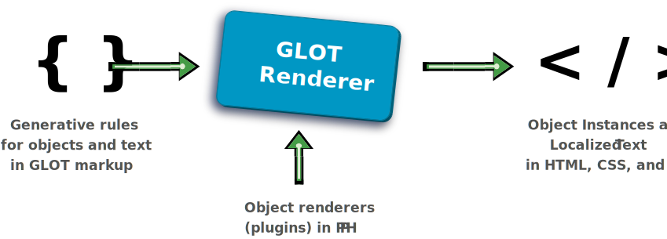

<p align="center">
  
</p>

[Framework](#framwork) / [Modules](#modules) / Renderer

# Rendering GLOT Webpages

**GLOT** is both a [language](#language) and a [framework](#frameork) for building static and dynamic websites. The name stands for _Generative Language of Objects and Text_. This section of the documentation describes the **Renderer** module of the framework.

The **Renderer** is a standalone module of the framework with no dependencies on other modules or libraries. Its objective is to interpret the GLOT language into a standard webpage.

The standard syntax of the GLOT language is the JavaScript Object Notation ([JSON](https://www.json.org/json-en.html)). The language adds compositionality and multilingualism to the website building process.

-   **Compositionality** is achieved by nesting JSON objects such that, at rendering time, they interpreted as the recursive instantiation rules of widget packages.

-   **Multilingualism** is achieved by enabling the use of localizable JSON objects when unilingual values are otherwise expected in HTML.

The input to the **Rendered** is a file with the GLOT markup of a page and all the widget packages referenced by the [widget objects](#widgets) in it. A **widget object** is, in turn, defined by a [widget package](#widget-packages), which is the set source files and asset files needed to render the HTML, JS, and CSS of [widget instances](#definitions).

<!--  -->

<p align="center">
  
</p>

The output of the **Renderer** is generated efficiently because it depends on a simple parsing process. That efficiency enables the Rendered to be an effective engine for both static and dynamic webpages.

## Extensions and Integrations

In addition to [widgets](#widgets), which are part of the GLOT language, the **Renderer** can be extended with [Plugins](#Plugins). Morover, both the Renderer and its components can also be extended via [class inheritance](extending_with_class_inheritance.md).

The Renderer can be integrated with other tools across different languages, including PHP, NodeJS, and Python. For example, it is possible to use glot as a [NodeJS package](), or manage users using the PHP [Symphony plugin](). It is also natural to create [React components in glot]() using a plugin to process [JSX code](jsx_plugin.md).

GLOT can be naturally integrated with other web libraries and platforms because the language is simply a different way of defining web content (i.e. HTML, JS, and CSS). Some advanced integrations might require the development of [Renderer plugins](#plugins) in order to bridge the different technologies.

## Getting started

This tutorial covers the creation of a website project and the testing of it within a development environment. The minimum requirement to render a GLOT website is to have [PHP 7.1+](https://www.php.net/) installed.

There are three main ways to work with the framework:

1. use the [Composer](https://getcomposer.org/) package manager;
1. use the [glot-cli](#glot-cli) app; or
1. download the Renderer manually.

The following steps are for option 1, and assume that the [composer](https://getcomposer.org/) app is globally available from the command line.

An empty website project can be created by:

```zsh
$ mkdir {PROJECT-PATH}
$ cd {PROJECT-PATH}
$ composer require glot/renderer
```

where `{PROJECT-PATH}` is the path to the new folder that is to be created and initialized. The pages and folders of the website should be added under a `pages` sub-folder.

## Optional GLOT syntaxes

The standard syntax for the GLOT language is JSON because it can be parsed very efficiently by the [Renderer](renderer.md) while still being easy to edit by developers. The performance consideration is mostly relevant for dynamic websites in production environments. For development, other markup syntaxes offer additional advantages, such as more succinct coding and the option to add comments.

In order to get the best combination of features for different contexts, the GLOT framework allows for additional syntaxes enabled via optional plugins. During development, the pages can be loaded in their alternative syntaxes, while the [Builder](builder.md) generates their minimized JSON equivalents for production.

Some syntaxes, such as [YAML-GLOT](yaml_glot.md) and [HTML-GLOT](html_glot.md), are straightforward alternatives to the standard JSON-GLOT, whereas other syntaxes create entirely new coding experiences. For example, GLOT, YAML and Markdown are combined to create [GLAML](glaml.md), a _Generative Language for Another Markup Language_, which is a hybrid language that behaves like a Markdown with widgets and master pages.

---

## Next steps

1. Learn more about [the GLOT framework](#framework)

1. Learn more about [the GLOT language](#language)

1. Follow a visual tutorial on [website building with GLOT](#web-building-tutorial)

1. Learn how to [create widget packages](#create-widget-packages)

1. Search the [Glot Bazaar](http://glotbazaar.com) for solutions to your website needs

<!-- ## Adding website folders and pages

A [complete guide](http://glot-guide.com) to build websites is available, but for the purposes of this tutorial, we can create some simple pages and components to get a sense of what is possible. -->

## Contributing

This project welcomes contributions and suggestions. Most contributions require you to agree to a Contributor License Agreement (CLA) declaring that you have the right to and actually do, grant us the rights to use your contribution. For details, visit our Contributor License Agreement (CLA).

When you submit a pull request, a CLA-bot will automatically determine whether you need to provide a CLA and decorate the PR appropriately (e.g., label, comment). Simply follow the instructions provided by the bot. You will only need to do this once across all repos using our CLA.

This project has adopted the [Proximify Open Source Code of Conduct](code_of_conduct.md). For more information see the Code of Conduct FAQ or contact support@proximify.com with any additional questions or comments.

## License

Copyright (c) Proximify Inc. All rights reserved.

Licensed under [GPLv2](https://www.gnu.org/licenses/old-licenses/gpl-2.0.en.html) (or later) from the [Free Software Foundation](https://www.fsf.org/).

GLOT is made by Proximify. We invite the community to participate.
