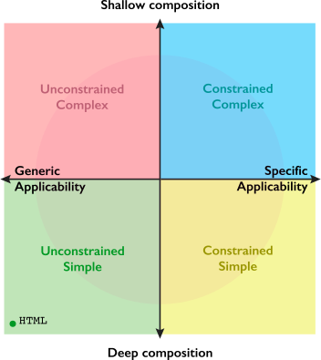

  

[Framework](#framwork) / [Components](#Components) / Widgets

# Designing GLOT widgets

## Design principles

Objectives

-   Support team work
-   Make it easy for non-technical individuals to contribute
-   Reuse across different projects
-   Accommodate changing requirements

### Generic vs specific applicability

Unconstrained simple
Unconstrained complex
Constrained complex
Constrained simple

### Deep vs shallow composition

### Design compass

The following design compass depicts the spectrum of decision involved in designing a widget. Should it...

-   be a generic piece for all kinds of layouts?
-   produce to complex layouts without the addition of inner widgets?
-   focus on specific needs and be easy to configure?
-   be generic and easy to use?

  

While the is no perfect answer for all scenarios, there are some guiding rules that have proven effective in practice.

1. Start the design at the center of the compass, and go towards the quadrant that best matches the requirements for the widget;
1. If in doubt, go towards the **Constrained-Complex** quadrant;
1. Aim to be as far from the center as necessary and no more.
